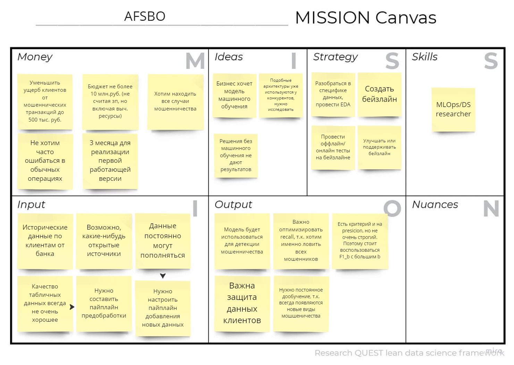
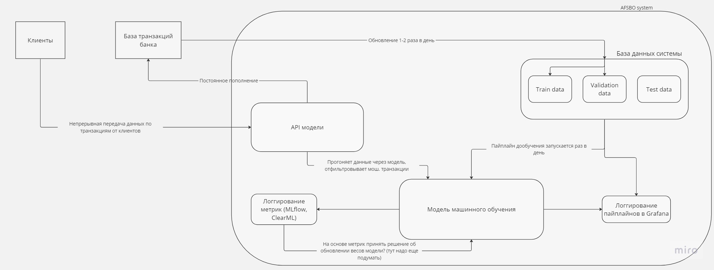

# AFSBO
Anti-Fraud System for Banking Operations

## 1. Цели проектируемой анти-фрод системы.

### Цель в общем: 
-----
Требуется создать систему для детектирования мошеннических операций при проведение онлайн-платежей для того, чтобы сократить ущерб клиентов от таких операций до 500 тыс. руб. и количество ложных срабатываний до 5%, причем требуется, чтобы система была готова выдерживать rpc порядка 400 запросов в секунду в пике, была разработана в течении 6 месяцав (причем через 3 месяца должен появиться работающий и удовлетворающий требованиям прототип) с бюджетом 10 млн. руб. (не считая зарплаты, но считая арендованные сервера и кластеры) и имела новейшие протоколы шифрования для контроля утечек данных.

-----
### Цели по порядку:

- Цели качества системы:
    - Уменьшить ущерб клиентов от мошеннических транзакций до 500 тыс. руб.
    - Доля ложных срабатываний не должна превышать 5%.
    - Система должна быть хорошо защищена от утечек.

- Цели бюджета системы:
    - Бюджет не более 10 млн.руб. (не считая зп)
    - Арендовать MLOps инструменты на YC для реализации проекта.

- Цели времени системы:
    - Сделать за 3 месяца работающий прототип, удовлетворяющий требованиям, в течение следующих 3 месяцов довести до прода.

## 2. Выбор метрики машинного обучения для оптимизации.

Для начала стоит заметить, что мы имеем дело со стандартной задачей бинарной классификации.
Во-вторых, видим, что основными требованиями к качеству - это как и желание предсказывать все возможные мошенические операции, тем самым увеличивая recall, но и не должны сильно обделять presicion, ведь ложных срабатываний должно быть не более 5%. 

Поэтому предлагается использовать F1-score (либо в дальнейшем при исследовании выбрать $F1_{\beta}$-score с некоторым $\beta$, выбранным на этапе анализа, чтобы больше учитывать либо recall, либо precision). 

Вообще, можно сделать так: определим precision в некотором диапазоне, а recall будем максимизировать. 

Как оценить precision? Мы знаем, что на 100 операций приходится 2 мошенических. Причем хотим <= 5 процентов ложных срабатываний. Получаем, что 5 процентов от 98 это грубо 5 операций. Поэтому нужно на 100 человек не более 5 ложных. Таким образом presicion должен быть >= $\frac{2}{7} \approx 0.3$. Это довольно мало. Тем самым нам важно лишь достигнуть precision порядка 30 процентов. Это довольно мало, поэтому кажется, что можно выбрать довольно большое $\beta$ в $F1_{\beta}$, чтобы recall был сильно важнее.

*Итог*: $F1_{\beta}$, где $\beta$ порядка 3-4 для перевеса в сторону recall.

## 3. Анализ особенности проекта.

## 4. Декомпозиция системы.

## 5. Определение задач.

1. Для того, чтобы лучше понять суть проблемы мошенничества в банках (возможно, вовсе не требуется модель), нужно в течении 2 дней после получения данных провести разведывательный анализ(EDA).
2. Для того, чтобы убрать шум и выбросы из данных, привести их в нормальных вид для получения нормального качества модели, создать за 2 дня после проведения EDA пайплайн для предобработки данных (на основе EDA из п.1), зафиксировать тестовую выборку для всех дальнейших экспериментов.
3. На основе очищенных данных из п.2, создать бейзлайн модели машинного обучения на основе логистической регрессии, подобрать параметры с помощью RandomSearch и получить метрики качества в течение 3 дней.

## 6.Создание репозитория и Kanban-доски. 
Done